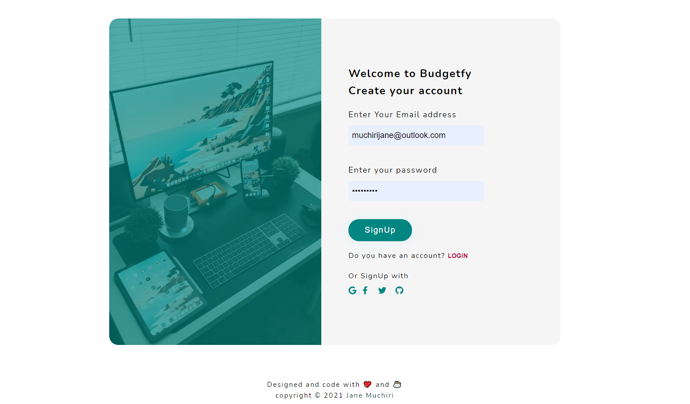

# Next-login-template
## Live Code - [Preview](https://next-firebase-login-template.vercel.app/)
<!-- ctrl+shift+v : preview -->


---

### Table of Contents
- [Description](#description)
- [How To Use](#how-to-use)
- [Author Info](#author-info)

---

## Live - [Preview](https://next-firebase-login-template.vercel.app/)

## Description
- I created this login and sign up template to see how to use firebase and firebase cloud. I was able to enable the FaceBook, GitHub and Google
for sign in or login. Learnt how create apps that need facebook or GitHub authentication for users to access an application.To make routing easier I used Next Js with is amazing for static generated websites and has a great SEO performance. The advantage of using firebase it's able to detect if an email address was already used before or it was blocked in the firebase dashboard.

#### Technologies
- Styled-component
- React
- Firebase


[Back To The Top](Next-login-template)

---
#### Installation
```bash
    Use a command Prompt and type : npm install
    # or
    npm i
```

## How To Use
First, run the development server:

```bash
npm run dev
# or
yarn dev
```

Open [http://localhost:3000](http://localhost:3000) with your browser to see the result.

#### How to use:

1. Create your Firebase Project
2. Activate authentication on your project
 - Email
 - Google
 - Facebook
 - Github
3. Create a .env file and paste your api key like this:

```
NEXT_PUBLIC_API_KEY=yourapikeyhere
```

4. Go to firebase/Firebase.js and fill on with your project details
5. npm run dev


## Author Info
#### [Jane Muchiri ](https://github.com/muchirijane)

- Twitter - [@TracyCss](https://twitter.com/TracyCss)
- Website - [portfolio](https://jane.vercel.app/)

[Back To The Top](Next-login-template)

